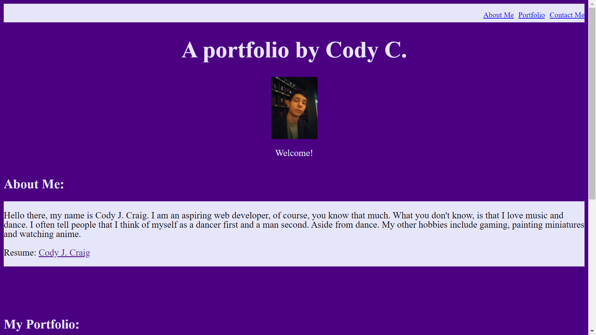

*Welcome to my 2nd homework project!*

Index.html:
With this project I began completely from scratch, as I wanted to challenge myself to code these elements individually. I coded each section one piece at a time building from top to bottom. Starting with the navbar that holds all my links, I decided on the colors I would use and the general layout of the page. I moved to the header section after that making sure my title and welcome message were setup in an appealing way. After that that different sections. The about me sections was fairly simple to build as it only contains a title and paragraph. I gave it some flair by giving it a specific color and aligning it on the right side of the page. Next the most difficult section, the portfolio was more complicated due to there being more different types of content to place in that section. I started with all the titles and descriptions and made sure they were in the layout I desired. Next I added the images and sized them accordingly. The last section, the contact info, was placed and aligned as desired. Ending with the footer, to sign my created page.

Style.css:
I took my css in chunks corresponding with the index.html as I built it. I followed the exact same path as before, starting with the navbar, then each respective section (about me, portfolio, contact me.) However there was the needed addition of responive layout for other devices, this was the last bit of functionality I added to the web page. I touched up the last details with some final image resizing.

https://themimmzyy.github.io/Portfolio/
